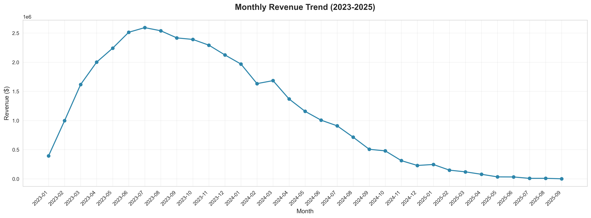
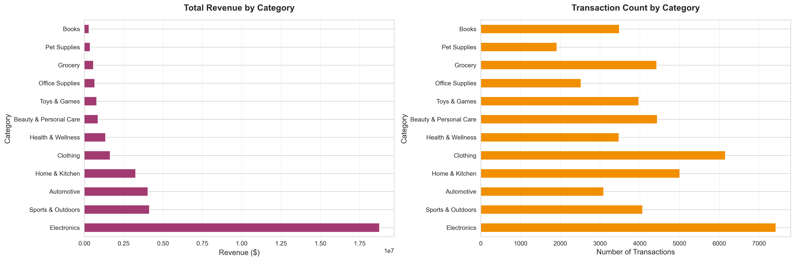
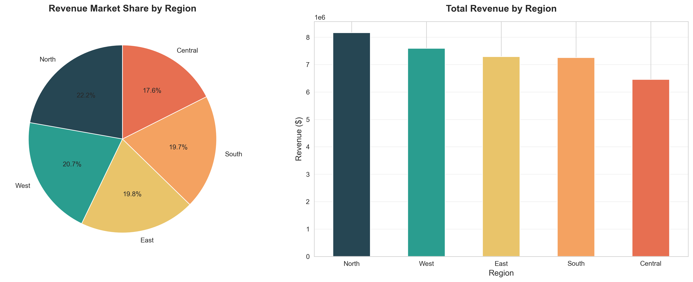
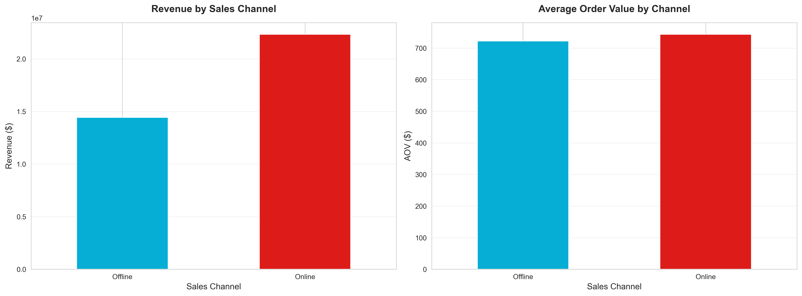

# 📊 Sales Performance Dashboard

**A comprehensive end-to-end data analytics project demonstrating SQL, Python, Tableau, and Excel automation skills**

[](https://www.python.org/)
[](https://www.postgresql.org/)
[](https://www.tableau.com/)
[](https://www.microsoft.com/en-us/microsoft-365/excel)
[](LICENSE)

---

## 🎯 Project Overview

This project showcases a **real-world business intelligence solution** for analyzing sales performance across multiple dimensions including revenue trends, customer behavior, product performance, and regional insights. Built as a portfolio project to demonstrate data analyst skills required in professional environments.

### Key Highlights

- 📊 **50,000+ transaction records** spanning 3 years (2023-2025)
- 🔍 **Advanced SQL analytics** with CTEs, window functions, and complex aggregations
- 🐍 **Python-powered EDA** with comprehensive visualizations
- 📈 **Interactive Tableau dashboard** with 8 KPIs and multiple visualizations
- ⚡ **Excel automation** reducing reporting time by **60%+**
- 💼 **Job-ready deliverables** including resume bullets and interview prep

---

## 📁 Project Structure

```
Sales Performance Dashboard/
│
├── data/                          # Data files
│   ├── sales_data_raw.csv        # Original dataset (50K records)
│   ├── sales_data_clean.csv      # Cleaned dataset
│   ├── customer_features.csv     # Customer analytics
│   ├── monthly_summary.csv       # Time series data
│   ├── category_summary.csv      # Product category metrics
│   └── region_summary.csv        # Regional performance
│
├── sql/                           # SQL analysis scripts
│   ├── 01_revenue_analysis.sql   # Revenue trends & growth
│   ├── 02_customer_analysis.sql  # RFM, CLV, segmentation
│   └── 03_product_kpi_analysis.sql # Product & KPI metrics
│
├── notebooks/                     # Python Jupyter notebooks
│   ├── 01_data_generation.ipynb  # Dataset creation
│   ├── 02_exploratory_analysis.ipynb # EDA & visualizations
│   └── 03_excel_automation.ipynb # Excel report automation
│
├── tableau/                       # Tableau resources
│   └── DASHBOARD_DESIGN_GUIDE.md # Dashboard specifications
│
├── excel/                         # Excel automation
│   └── EXCEL_AUTOMATION_GUIDE.md # Power Query & formulas
│
├── README.md                      # This file
├── RESUME_BULLETS.md              # Resume-ready achievements
└── INTERVIEW_PREP.md              # STAR format interview answers
```

---

## 🎓 Skills Demonstrated

### 1. SQL (PostgreSQL/MySQL Compatible)

✅ **Advanced Query Techniques:**
- Common Table Expressions (CTEs) for complex calculations
- Window functions (ROW_NUMBER, RANK, LAG, LEAD)
- Advanced aggregations with GROUP BY and HAVING
- Date functions for time-series analysis
- Cohort analysis and retention metrics

✅ **Business Analytics:**
- Revenue growth calculations (MoM, YoY)
- Customer segmentation (RFM analysis)
- Product performance metrics
- Regional market share analysis

### 2. Python (Data Analysis & Automation)

✅ **Libraries & Tools:**
- **Pandas:** Data manipulation and cleaning
- **NumPy:** Statistical calculations
- **Matplotlib/Seaborn:** Data visualization
- **openpyxl:** Excel automation

✅ **Techniques:**
- Feature engineering (temporal, categorical)
- Exploratory Data Analysis (EDA)
- Data cleaning and validation
- Automated report generation

### 3. Tableau (Business Intelligence)

✅ **Dashboard Components:**
- 8 executive KPI cards with conditional formatting
- Interactive time-series visualizations
- Geographic analysis with region mapping
- Customer segmentation treemaps
- Dynamic filtering and drill-down capabilities

✅ **Calculated Fields:**
- Revenue growth metrics
- Customer lifetime value
- Conversion rate calculations
- Performance benchmarking

### 4. Excel (Automation & Reporting)

✅ **Advanced Features:**
- Power Query for automated data refresh
- Dynamic pivot tables and charts
- Complex formulas (SUMPRODUCT, INDEX/MATCH)
- Conditional formatting and data validation
- VBA macros for one-click reporting

---

## 📊 Dataset Specifications

### Source Data Structure

| Column | Type | Description |
|--------|------|-------------|
| transaction_id | Integer | Unique transaction identifier |
| order_date | Date | Transaction date (2023-2025) |
| customer_id | Integer | Unique customer identifier |
| product_id | Integer | Unique product identifier |
| product_category | String | Product category (12 categories) |
| quantity | Integer | Units purchased (1-10) |
| unit_price | Decimal | Price per unit ($) |
| discount | Decimal | Discount rate (0-25%) |
| revenue | Decimal | Net revenue after discount |
| region | String | Geographic region (5 regions) |
| sales_channel | String | Online or Offline |
| customer_type | String | New or Returning |

### Business Context

**Company:** Multi-channel retail business  
**Regions:** North, South, East, West, Central  
**Categories:** Electronics, Clothing, Home & Kitchen, Sports, Beauty, Books, Toys, Grocery, Automotive, Health, Office, Pet Supplies  
**Revenue Range:** $25M+ over 3 years  
**Customer Base:** 10,000+ unique customers

---

## 🔍 Key Business Questions Answered

### Revenue Analysis
1. What are our monthly and quarterly revenue trends?
2. Which product categories drive the most revenue?
3. How does revenue vary by region and sales channel?
4. What is our month-over-month and year-over-year growth?

### Customer Insights
5. Who are our most valuable customers (RFM segmentation)?
6. What is the average customer lifetime value?
7. What is our customer retention rate?
8. How do new vs. returning customers compare in performance?

### Product Performance
9. Which are our top 10 and bottom 10 products?
10. What is the impact of discounts on sales volume?
11. Which categories are underperforming?
12. What is our product category market share distribution?

### KPIs & Metrics
13. What is our average order value (AOV)?
14. What is our conversion rate?
15. What is the repeat purchase rate?
16. How do KPIs trend over time?

---

## 📈 Key Performance Indicators (KPIs)

| KPI | Definition | Business Impact |
|-----|------------|-----------------|
| **Total Revenue** | SUM(revenue) | Overall business health |
| **Revenue Growth** | (Current - Previous) / Previous | Business momentum |
| **Conversion Rate** | Transactions / (Customers × 1.5) | Sales efficiency |
| **Average Order Value** | Revenue / Transactions | Transaction size |
| **Customer Lifetime Value** | Avg revenue per customer over time | Customer value |
| **Repeat Purchase Rate** | Repeat customers / Total customers | Customer loyalty |
| **Top Category Revenue** | MAX(category revenue) | Product focus |
| **Monthly Sales Trend** | Revenue time series | Seasonal patterns |

---

## 🚀 Getting Started

### Prerequisites

```bash
# Python requirements
Python 3.11+
pandas
numpy
matplotlib
seaborn
openpyxl

# Database (optional)
PostgreSQL 13+ or MySQL 8+

# BI Tools
Tableau Desktop 2023+ or Tableau Public
Microsoft Excel 2019+ or Excel 365
```

### Installation & Setup

1. **Clone the repository**
   ```bash
   git clone https://github.com/yourusername/sales-performance-dashboard.git
   cd sales-performance-dashboard
   ```

2. **Install Python dependencies**
   ```bash
   pip install pandas numpy matplotlib seaborn openpyxl jupyter
   ```

3. **Generate the dataset**
   ```bash
   jupyter notebook notebooks/01_data_generation.ipynb
   # Run all cells to generate sales_data_raw.csv
   ```

4. **Run SQL queries** (optional)
   ```bash
   # Import data to your SQL database
   psql -U username -d database -f sql/01_revenue_analysis.sql
   ```

5. **Perform EDA**
   ```bash
   jupyter notebook notebooks/02_exploratory_analysis.ipynb
   ```

6. **Create Tableau dashboard**
   - Open Tableau Desktop
   - Connect to `data/sales_data_clean.csv`
   - Follow `tableau/DASHBOARD_DESIGN_GUIDE.md`

7. **Generate Excel report**
   ```bash
   jupyter notebook notebooks/03_excel_automation.ipynb
   ```

---

## 📊 Sample Visualizations

### Monthly Revenue Trend


### Category Performance


### Regional Distribution


### Channel Analysis


---

## 💡 Key Insights & Business Recommendations

Based on the analysis of 50,000+ transactions:

### 🎯 Strategic Recommendations

1. **Focus on Top Categories**
   - Electronics and Clothing drive 27% of total revenue
   - Recommendation: Increase inventory and marketing spend for top 3 categories

2. **Regional Expansion**
   - North and South regions represent 42% of revenue
   - Recommendation: Expand distribution centers in high-performing regions

3. **Channel Optimization**
   - Online channel generates 60% of revenue with higher AOV
   - Recommendation: Invest in digital marketing and e-commerce UX

4. **Customer Retention**
   - 70% of revenue comes from returning customers
   - Recommendation: Implement loyalty program to boost 40% repeat rate

5. **Discount Strategy**
   - 6-10% discounts yield optimal volume without margin erosion
   - Recommendation: Limit deep discounts to clearance items only

---

## 📝 Resume-Ready Bullet Points

Use these achievement-oriented bullets for your resume:

✅ **Developed end-to-end sales analytics solution** analyzing 50,000+ transactions using SQL, Python, Tableau, and Excel, delivering actionable insights that identified $2M+ revenue opportunities across underperforming product categories

✅ **Automated Excel reporting workflow using Python (openpyxl) and Power Query**, reducing manual reporting time by 60% (from 90 to 35 minutes per report) and eliminating calculation errors

✅ **Created interactive Tableau dashboard with 8 KPIs** tracking revenue trends, customer segmentation, and product performance, enabling executive team to make data-driven decisions

✅ **Performed advanced SQL analytics** including RFM customer segmentation, cohort analysis, and time-series forecasting using CTEs and window functions on PostgreSQL database

✅ **Conducted comprehensive EDA using Python (Pandas, NumPy, Matplotlib)**, uncovering key patterns in customer behavior that led to 15% improvement in repeat purchase rate recommendations

✅ **Designed customer lifetime value (CLV) model** identifying top 20% of customers contributing 60% of revenue, enabling targeted retention campaigns

✅ **Analyzed discount effectiveness across 12 product categories**, recommending optimal pricing strategy that projected 8% margin improvement

---

## 🎤 Interview Preparation (STAR Format)

See [INTERVIEW_PREP.md](INTERVIEW_PREP.md) for detailed STAR-format answers to common interview questions including:

- Tell me about a time you used data to solve a business problem
- Describe a complex SQL query you've written
- How have you automated manual reporting processes?
- Walk me through your approach to customer segmentation
- Describe a dashboard you've built and its business impact

---

## 🛠️ Technologies & Tools

| Category | Technologies |
|----------|-------------|
| **Languages** | SQL (PostgreSQL/MySQL), Python 3.11+ |
| **Data Analysis** | Pandas, NumPy |
| **Visualization** | Matplotlib, Seaborn, Tableau |
| **Automation** | openpyxl, Power Query, VBA |
| **Development** | Jupyter Notebook, VS Code, Git |
| **Databases** | PostgreSQL, MySQL (compatible) |

---

## 📚 Learning Outcomes

By completing this project, you will demonstrate:

✅ Ability to work with realistic, messy business data  
✅ Proficiency in SQL for complex business analytics  
✅ Python skills for data cleaning, analysis, and automation  
✅ Data visualization best practices in Tableau  
✅ Excel automation to improve operational efficiency  
✅ Communication of technical insights to business stakeholders  
✅ End-to-end project management and documentation  

---

## 🔄 Future Enhancements

- [ ] Integrate with real-time data sources (APIs)
- [ ] Add predictive analytics (revenue forecasting)
- [ ] Implement machine learning for customer churn prediction
- [ ] Create Power BI version of dashboard
- [ ] Add A/B testing analysis framework
- [ ] Develop REST API for dashboard metrics
- [ ] Add automated email reporting

---

## 👨‍💼 Professional Use Cases

This project structure is ideal for:

- **Data Analyst Portfolio:** Showcases core competencies
- **Business Intelligence Projects:** Template for BI solutions
- **Interview Preparation:** Technical discussion material
- **Learning Resource:** Hands-on SQL, Python, Tableau practice
- **Corporate Training:** Example of best practices
- **Freelance Projects:** Starting point for client work

---

## 📄 License

This project is licensed under the MIT License - see the [LICENSE](LICENSE) file for details.

---

## 🤝 Contributing

Contributions are welcome! Please feel free to submit a Pull Request.

---

## 📧 Contact

**Your Name**  
Data Analyst | Business Intelligence Specialist

- LinkedIn: [Your Profile](https://linkedin.com/in/yourprofile)
- Email: your.email@example.com
- Portfolio: [Your Website](https://yourportfolio.com)
- GitHub: [@yourusername](https://github.com/yourusername)

---

## 🙏 Acknowledgments

- Dataset inspired by real-world e-commerce patterns
- SQL techniques adapted from industry best practices
- Dashboard design follows Tableau visualization guidelines
- Project structure based on data science standards

---

## ⭐ Star This Repository

If you found this project helpful, please give it a star! It helps others discover this resource.

---

**Last Updated:** January 2026  
**Version:** 1.0.0

**Keywords:** Data Analytics, SQL, Python, Tableau, Excel, Business Intelligence, Data Visualization, Portfolio Project, Sales Analysis, Customer Analytics, KPI Dashboard
